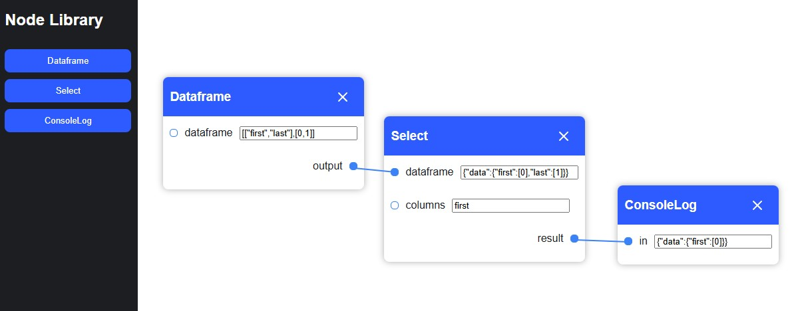

# Rigatoni

### A generic Node Graph for Javascript

Rigatoni allows developers who need a node graph interface to easily create their own nodes and initialize an editor. A rigatoni node is a class in the library. Each node class has inputs, outputs, and an onUpdate function which is called when the values change. See the demo folder for examples.